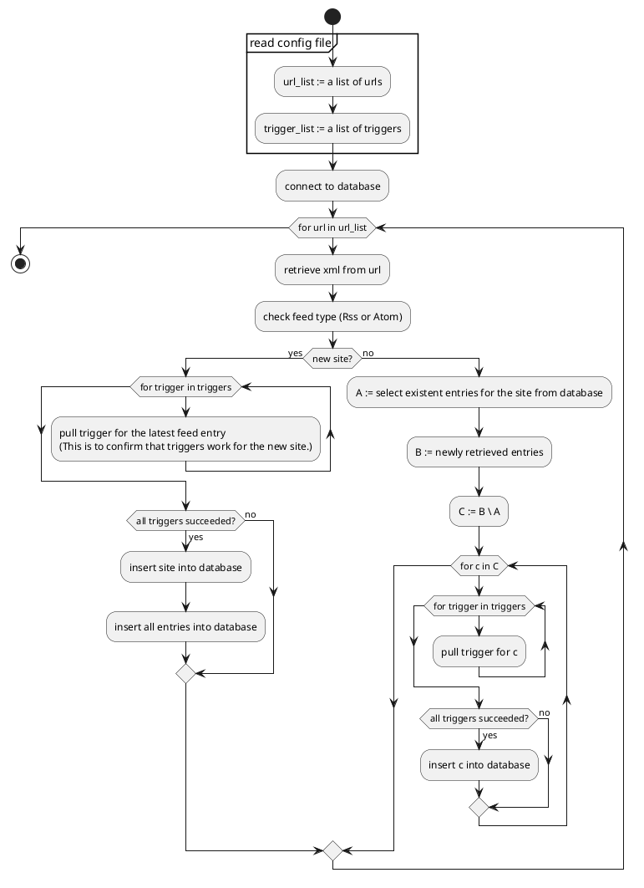

# rsst

# 1. About

Supports RSS 2.0 feeds and Atom feeds.

Written in Rust and Go.

Cross-platform.

CUI.

docker

# 2. Triggers

# 3. Configurations

# 4. Build

# 5. References

- [*RSS 2.0 specification - W3C*](https://validator.w3.org/feed/docs/rss2.html)

- [*Introduction to Atom - W3C*](https://validator.w3.org/feed/docs/atom.html)

# 6. Database Design

| Name | Description |
|:--|:--|
| `feeds` | Represents each site. |
| `feed_items` | Represents each blog entry. |

# 7. Algorithms

