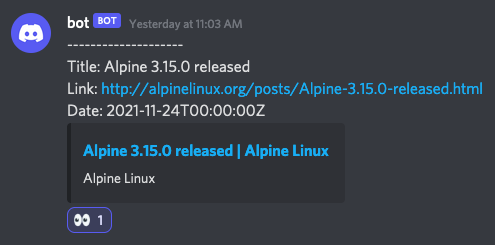
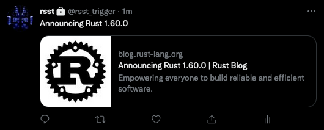
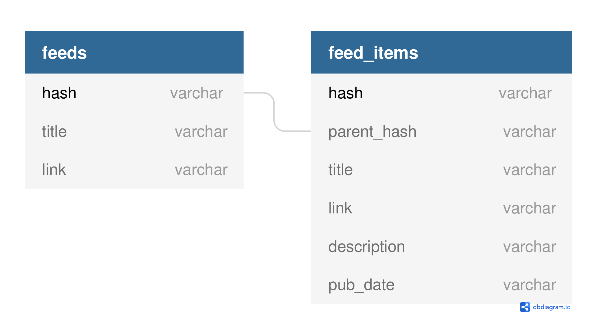
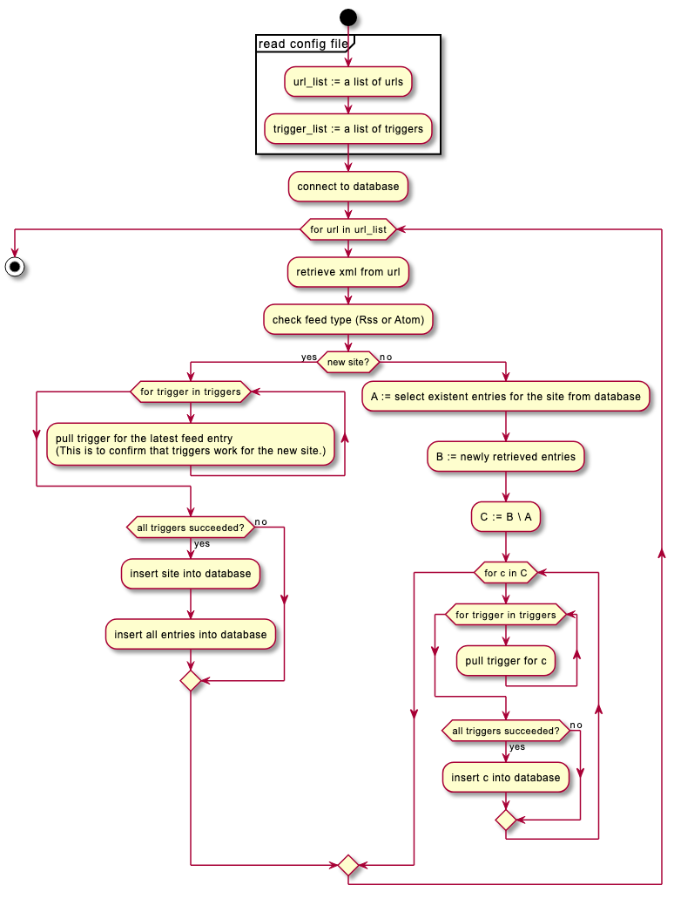
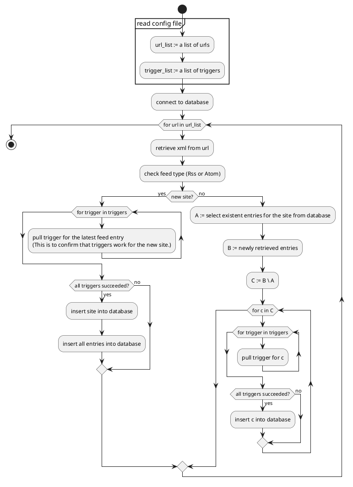

# rsst

# 1. About

*rsst* is a json-driven CUI rss/atom feed reader for command-line addictive users.

It is written in Rust.

Main Features:

- Cross-platform.

- Both RSS 2.0 and Atom are supported.

- `Dockerfile` and `docker-compose.yaml` are included.

- Configurations (including a list of feed sites) are written in a single JSON file.

- User-defined *triggers* (see below).

# 2. Triggers

When rsst detects new blog entries, it runs a series of registered *triggers* for each entry.

## 2.1 `Discord` trigger

`Discord` trigger sends a message to a Discord server.

||
|:--:|
| An example of `Discord` trigger. |

## 2.2 `Twitter` trigger

`Twitter` trigger posts a tweet. We operate [@rsst_trigger](https://twitter.com/rsst_trigger), using this trigger.

||
|:--:|
| An example of `Twitter` trigger. |

## 2.3 Other Triggers

In a similar manner, any triggers can be implemented by yourself (or via feature requests perhaps).

Here's the list of my future ideas:

- `Pocket` trigger to add an new blog entry to your Pocket list.

# 3. Configurations

## 3.1 About

rsst reads `./conf/config.json` as the configuration file. This file is auto-reloaded without the need of restarting a Docker container.

You need not to write this config file from scratch. Just start by copying the template:

```bash
cp conf/config_template.json conf/config.json
vi conf/config.json
```

Comments of the form `^\s*#.*$` are allowed.

## 3.2 Example

```json
{
    #This is a comment.
    "should_log_debug": true,
    "database_file": "./conf/db.sqlite3",
    "triggers": {
        "discord": {
            "enabled": true,
            "webhook_url": "..."
        },
        "twitter": {
            "enabled": true,
            "consumer_key": "...",
            "consumer_secret": "...",
            "access_token": "...",
            "access_token_secret": "..."
        }
    },
    "feed_url_list": [
        {
            "url": "https://blog.rust-lang.org/feed.xml"
        },
        {
            "url": "http://feeds.feedburner.com/oreilly/newbooks",
            "should_omit_date_field_from_hash": true
        },
        {
            "url": "https://go.dev/blog/feed.atom",
            "is_golang_blog_mode": true
        }
    ]
}
```

## 3.3 `feed_url_list`

The array `feed_url_list` is where you register your favorites RSS/Atom feeds. Each element is of the type `Object` rather than simply a URL (`String`). This object has this structure:

| Field | Required | Default Value | Description |
|:-|:-|:-|:-|
| `url` | Yes | - | URL of RSS/Atom feed. |
| `should_omit_date_field_from_hash` | No | `false` | A feed item is regarded as *new* when its hash value is not found in the database, and the hash is calculated using the item's title, link, publish date, etc. When `should_omit_date_field_from_hash == true`, the publish date is omitted from the calculation. This is sometimes useful as some feed suppliers often (e.g. everyday) update the values of publish date fields of existing feed items. |
| `is_golang_blog_mode` | No | `false` | Undocumented. This is very specific. You may want to turn this on only when you specify `https://go.dev/blog/feed.atom` as `url`. |

# 4. Build

1. First clone this repository and modify the configuration file as you like.

    ```bash
    git clone 'https://github.com/your-diary/rsst'
    cd rsst
    cp conf/config_template.json conf/config.json
    vi conf/config.json
    ```

2. Then build a docker image.

    ```bash
    docker compose build
    ```

3. (Optional) By default, rsst checks new entries for each registered site once an hour. You can customize this interval by changing the environment variable `${RSST_INTERVAL_MIN}`.

    ```bash
    vi docker-compose.yaml
    ```

4. Start a docker container.

    ```
    docker compose up -d
    ```

5. (Optional.) At this point, the host-side `./conf/` directory is bind-mounted to the docker container. A SQLite3 database and a log file are created in this directory. To see the real-time log output, run either the followings, both of which behave exactly the same.

    ```bash
    docker logs -f rsst
    ```

    ```bash
    tail -f conf/log.txt
    ```

# 5. For Developers

## 5.1 References

- [*RSS 2.0 specification - W3C*](https://validator.w3.org/feed/docs/rss2.html)

- [*Introduction to Atom - W3C*](https://validator.w3.org/feed/docs/atom.html)

## 5.2 Database Design

| Name | Description |
|:--|:--|
| `feeds` | Represents each site. |
| `feed_items` | Represents each blog entry. |



## 5.3 Algorithms



<!--



-->
